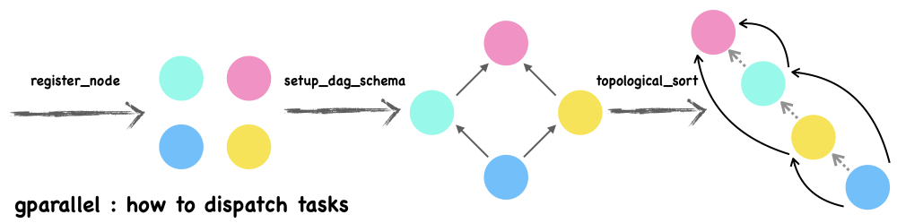

# gParallel 

[](https://www.travis-ci.org/galois-advertising/gparallel)


`gparallel`是一个针对具有复杂流程或逻辑的单体式信息检索系统而设计的并行任务调度框架。使用`Meta Programming`技术根据任务的输入和输出自动推导依赖关系，生成`DAG(Directed acyclic graph)`并进行并行任务调度。

# Quick start

* 编译依赖
    - g++8
    - boost_log-mt v1.70
    - gtest v1.10.0

## 下载编译test和demo

```shell
$ git clone git@github.com:galois-advertising/gparallel.git
$ cd gparallel
$ git submodule update --init --recursive
$ mkdir build
$ cd build
$ cmake ..
$ make
$ ./test
$ ./demo
```

## 将gparallel作为你项目的一部分

首先将`gparallel`以及所依赖的`common`和`gtest`设置为`git submodule`。

```shell
cd your-project
git add submodule -b master https://github.com/galois-advertising/gparallel
git add submodule -b master https://github.com/galois-advertising/common
git add submodule https://github.com/google/googletest.git gtest
cd gtest
git checkout release-1.10.0
git add gtest
git commit -m "Add gparallel"
```

并且修改`CMakeLists.txt`，加入：

```cmake
INCLUDE_DIRECTORIES("${CMAKE_SOURCE_DIR}/common/util/include")
INCLUDE_DIRECTORIES("${CMAKE_SOURCE_DIR}/gparallel/include")
IF (NOT TARGET common)
    ADD_SUBDIRECTORY(common)
ENDIF()

IF (NOT TARGET gparallel)
    ADD_SUBDIRECTORY(gparallel)
ENDIF()
ADD_EXECUTABLE(your-bin ...)
TARGET_LINK_LIBRARIES(your-bin common gparallel)
```

# 背景介绍

对于单体型业务系统，在系统建立初期，系统业务还比较简单，每次`检索请求`到来时需要执行的业务逻辑也比较单一，此时请求级别的`数据变量`比较少，这些变量的赋值顺序与依赖关系也一目了然，系统很容易维护。

但是，随着开发的人越来越多，大家都在上面加入自己的`业务逻辑`和新的`数据变量`，此时变量增加到了几百个，变量之间的赋值顺序与依赖关系开始变得复杂，一些代码逻辑甚至打破了已有的流程结构（俗称飞线），整个系统难以理解。没有一个人能说清楚这些变量之间的依赖关系以及这些业务逻辑之间的执行顺序，每次新的开发都如履薄冰，每次排查问题都耗时耗力。

对于多人参与，迭代密集的系统，如何更合理地组织各类型的数据，如何更好地实现繁杂的业务逻辑，这就是为需要`gparallel`的理由.


> `gparallel`是一款基于`DAG(Directed acyclic graph)`的并且支持自动依赖推导的任务调度框架。

`DAG`在计算机领域有着广泛的应用，例如在大数据计算中可以使用DAG指导Hadoop任务的执行顺序等等。在软件设计中也被广泛应用，开源社区中DAG-based调度框架也有很多，例如[cpp-taskflow](https://github.com/cpp-taskflow/cpp-taskflow)。但是，几乎所有框架都采用了 **手工配置的方式** 生成调度DAG。例如在一个拥有四个任务的调度系统中，`cpp-taskflow`需要通过下面方式来配置DAG。

```cpp
    auto [A, B, C, D] = taskflow.emplace(
      [] () { std::cout << "TaskA\n"; },
      [] () { std::cout << "TaskB\n"; },
      [] () { std::cout << "TaskC\n"; },
      [] () { std::cout << "TaskD\n"; }
    );
    A.precede(B);  // A runs before B 
    A.precede(C);  // A runs before C 
    B.precede(D);  // B runs before D 
    C.precede(D);  // C runs before D 
}
```


上面代码中想要生成预期的DAG图需要人工显式定义每两个节点之间的依赖关系，这种方式虽然理解比较直观，但是缺点也非常明显：

* **在有大量任务的时候，人工定义DAG图比较困难并且容易出错。现实中的业务系统一般是多人同时开发，这就需要模块owner对所有的任务节点之间的依赖关系进行人工梳理，可维护性较差。**
* **工业环境中很多业务，往往以数据流驱动的方式表达会更加清晰，这就需要花费大量时间来将系统逻辑从数据驱动表示强行转化为任务驱动表示来适配调度系统，耗时耗力。**

# gparallel如何解决问题

gparallel的主要思想有3个：

* `数据划分`：将所有数据成员，按照**业务逻辑**和**数据状态**划分为不同的集合。
* `依赖推导`：将所有的代码逻辑，按照功能划分为不同的task节点，并且自动推导task节点之间的依赖关系，建立DAG。
* `任务调用`：通过拓扑排序，将`DAG`转化为`偏序`表示，并使用thread或者coroutine对task进行调度。

## 数据划分

在检索系统中，`数据`一般就是指检索过程中用来存储中间结果和最终结果的变量，比如存储广告的`std::list`，存储标题的`std::string`。gparallel主要从2个角度进行划分：

* `按照业务逻辑`：把不同业务逻辑所需要用到的数据划分为不同的集合。比如有不同的广告营销产品，各自都有自己的User、Plan和Ad的集合，以及一些存储数中间结果的变量。为了方便描述，我们用大写字母来表示按照业务逻辑划分出来的数据即可，例如`A`、`B`、`C`等等。

* `按照数据状态`：更进一步，对于服务于同一个业务的数据集合(A)，在不同的阶段，又可以划分为不同的状态。例如一个广告队列，初始状态是空(empty)，经过填充以后有N条广告(inited)，又经过了一次按照CTR的排序(ranked)，最后经历了一次截断(truncate)，那么对应四个状态`A_empty`，`A_inited`，`A_ranked`，`A_truncated`。

为了方便理解，我们把划分出来的每个子集，叫做`meta`。前面提到的`A_empty`，`A_inited`，`A_ranked`，`A_truncate`都是`meta`。在gparallel中，我们用[`DECL_META`](include/meta.h)宏来定义一个`meta`。

> meta：表示**指定业务**所需要的所有数据的集合的**数据结构**。

理解gparallel对数据的2层递进划分方式非常重要，因为gparallel的DAG自动推导过程正是依赖于不同的meta。

现实中的系统中，数据成员一般放置在一个叫做`context`或者`thread_data`的结构体中。顾名思义，这些数据的作用范围就是一次请求，一个比较常见的设计是一次请求由线程池中的一个线程来独立负责，所以请求级别的数据，往往也是线程级别的数据。这个`context`或者`thread_data`的类型，我们定义为`meta_storage_t`，即所一次检索中用到的所有数据，都统一存储在这里。

通过定义`getter`和`setter`可以是先对子集元素的指定，如果定义了`getter`和`setter`就代表这个`meta`中包含这个数据成员。子集之间也可以互相包含，原理与面向对象中的`继承`是一样的。同理，如果一个任务依赖于一个`meta`，则也同样依赖于这个`meta`的父`meta`。`继承`机制的主要目的是为了避免重复定义集合的元素，增加代码的可维护性。通过下面的例子可以理解`meta_storage_t`、`meta`和`继承`的关系。

<div></div>

通过上图可以看到，`meta_common`包含了`thread_data::id`，`meta_a`同时包含了`thread_data::business_a`和`meta_common`的所有元素。`meta_b`同时包含了`thread_data::business_b`和`meta_common`的所有元素。

## 任务定义

在`gparallel`中，使用一个函数表示一个具体的任务，函数的参数表示任务的`输入`和`输出`。任何一个`meta`既可以作为`输入`，也可以作为`输出`。这里引入2个模版包装器`input`和`output`。如果`meta`用`input`包装，则任务函数会将其当作一个输入数据，同理如果用`output`包装，则会当作输出。

表示任务的函数，必须定义为类的静态成员函数，函数名字必须为`process`，返回类型为`void`。例如：

```cpp
struct DemoNode {
    void process(input<meta_a> a, input<meta_b> b, output<meta_c> c) {
        // process code
        c->mutable_business_c() = a->get_business_a() + b->get_business_b();
    }
}
```
上面的`DemoNode`实现了将`business_a`和`business_b`的和赋值给`business_c`的逻辑。
`process`函数可以拥有任意多个`输入`和任意多个`输出`。其中没有`输入`的节点作为起始节点之一，没有`输出`的节点作为终止节点之一。

## 任务调度

通过`register_node`函数将所有节点注册到`DAG`中后，使用`setup_dag_schema`函数可自动实现节点依赖分析以及`DAG`生成。针对生成的`DAG`进行`拓扑排序`，就能得到任务调度顺序。后面可根据具体情况，实现多线程或者多协程调度。

```cpp
dag_schema<thread_data> nodes;
register_node<thread_data, node_a, node_b, node_c ...>::reg(nodes);
setup_dag_schema<thread_data>(nodes);
if (auto tasks = topological_sort<thread_data>(nodes); tasks) {
    for (auto task : tasks.value()) {
        task->mutable_executor()(&td);
    }
}
```

<center></center>

# gparallel实战

在本小结中，会从一个现实的场景来描述`gparallel`的使用逻辑。

> 问题描述：对一个指定的广告队列，分别请求其`CTR`(点击率)值和`CPM`(千次展示成本)并填充到广告的对应字段，最后分别按照`CTR`和`CPM`进行排序后生成2个新的广告队列供下游使用。

上述流程是广告检索系统里面一个比较典型的逻辑，完整的代码在[./demo/advprocess.cpp](./demo/advprocess.cpp)。

## 数据划分

我们首先梳理一下所需要用到的数据对象：

数据名称 | 类型 |  含义  
-|-|-
advs_original|  advlist_t |  原始的广告队列 |
ctr_data |  advlist_t | 模型返回的ctr数据|
cpm_data |  advlist_t |  模型返回的cpm数据|
advs_ctr_ordered | ctr_response_t |  输出的ctr排序的广告队列|
advs_cpm_ordered | cpm_response_t |  输出的cpm排序的广告队列|

根据上面的定义，我们定义数据集合，业务执行需要用到的所有数据都放在`thread_data`这个集合中：


```cpp
class thread_data {
public:
    advlist_t advs_original;
    advlist_t advs_ctr_ordered;
    advlist_t advs_cpm_ordered;
    ctr_response_t ctr_data;
    cpm_response_t cpm_data;
};
```

接下来我们根据不同的业务，将集合划分为不同的子集，每个子集就是一个`meta`，一个元素可以同时属于多个`meta`，`meta`与`meta`，之间可以互相包含。
根据问题的描述，我们可以很容易总结出5个子流程，每个子流程都对应一个数据处理节点： 
<table width="60%">
    <thead>
        <tr>
            <th>流程</th><th>节点名称</th><th>输入</th><th>输出</th>
        </tr>
    </thead>
    <tbody>
        <tr>
            <td>获取CTR值</td><td>get_ctr_node</td><td>advs_original</td><td>ctr_data</td>
        </tr>
        <tr>
            <td>获取CPM值</td><td>get_cpm_node</td><td>advs_original</td><td>cpm_data</td>
        </tr>
        <tr>
            <td>填充字段</td><td>fill_node</td>
            <td>advs_original <br>ctr_data <br>cpm_data</td>
            <td>advs_original*</td>
        </tr>
        <tr>
            <td>生成CTR<br>排序队列</td><td>gen_ctr_node</td><td>advs_original*</td>
            <td>advs_ctr_ordered</td>
        </tr>
        <tr>
            <td>生成CPM<br>排序队列</td><td>gen_cpm_node</td>
            <td>advs_original*</td><td>advs_cpm_ordered</td>
        </tr>
    </tbody>
</table>


可以看到原始输入的广告队列是`advs_original`，这里我们将其封装为meta`original`。

`get_ctr_node`节点和`get_cpm_node`节点通过meta`original`分别获取`ctr_data`和`cpm_data`两份数据，这两份数据我们用meta`ctr`和meta`cpm`来封装。

`fill_node`节点对广告队列进行数据填充，这里注意，节点的输入中有meta`original`，输出中有meta`original_with_ctr_cpm`。这2个meta其实本质上都是`advs_original`的封装，但是因为属于2个阶段(即填充前和填充后)，所以分别用2个不同的meta来表示，在实现上，我们可以直接使用继承功能，复用meta`original`。

`gen_ctr_node`和`gen_cpm_node`的输入都包含meta`original_with_ctr_cpm`，表示其依赖于填充后的`advs_original`而不是填充前。

这样就可以根据不同的业务逻辑，把`thread_data`集合划分为不同的`meta`，每个业务只需要关注子集需要用到哪些`meta`，生成哪些`meta`即可。


## 任务定义

首先实现`get_ctr_node`和`get_cpm_node`这两个任务节点。
```cpp
struct get_ctr_node {
    static void process(input<original> ori, output<ctr> ctr) {
        INFO("[gparallel] get_ctr_node", "");
        ctr->mutable_ctr_data().resize(ori->mutable_advs_original().size());
        for (int pos = 0; pos < ori->mutable_advs_original().size(); pos++) {
            auto & adv = ori->mutable_advs_original()[pos];
            ctr->mutable_ctr_data()[pos] = 0.1 * static_cast<double>(adv.id);
        }
    }
};

struct get_cpm_node {
    static void process(input<original> ori, output<cpm> cpm) {
        INFO("[gparallel] get_cpm_node", "");
        cpm->mutable_cpm_data().resize(ori->mutable_advs_original().size());
        for (int pos = 0; pos < ori->mutable_advs_original().size(); pos++) {
            auto & adv = ori->mutable_advs_original()[pos];
            cpm->mutable_cpm_data()[pos] = 100.2 * static_cast<double>(adv.id);
        }

    }
};
```
这两个任务的功能相似，都是根据`original`中存储的所有广告，获取对应的`点击率`和`千次展示成本`数据，并且分别保存到`ctr`和`cpm`这两个meta。这里为了简化，我们取一些随机的数字作为`ctr`作为`cpm`。现实中往往需要同步或者异步请求模型服务器来获取。

接下来实现`fill_node`。
```cpp
struct fill_node {
    static void process(input<ctr> ctr, input<cpm> cpm, input<original> ori, 
        output<original_with_ctr_cpm> ori_ctr_cpm) {
        INFO("[gparallel] fill_node", "");
        for (int pos = 0; pos < ori->mutable_advs_original().size(); pos++) {
            auto & adv = ori_ctr_cpm->mutable_advs_original()[pos];
            adv.ctr = ctr->mutable_ctr_data()[pos];
            adv.cpm = cpm->mutable_cpm_data()[pos];
            INFO("[gparallel] ori_ctr_cpm adv:[%d] ctr:[%lf] cpm:[%lf]", adv.id, adv.ctr, adv.cpm);
        }
    }
};
```
`fill_node`节点将前面`get_ctr_node`和`get_cpm_node`这两个节点的输出作为自己的输入，最后生成`original_with_ctr_cpm`。这里可以看到，`original`和`original_with_ctr_cpm`分别作为节点的输入和输出，虽然这两个meta中包含的数据都是`advs_original`，但是对应了**不同的状态**。`original`代表了`advs_original`一开始的状态，而`original_with_ctr_cpm`代表了已经填充了`ctr`作为`cpm`数据的状态。

最后实现`gen_ctr_node`和`gen_cpm_node`。
```cpp
struct gen_ctr_node {
    static void process(input<original_with_ctr_cpm> ori_ctr_cpm, 
        output<ctr_ordered_advlist> ctr_ordered) {
        INFO("[gparallel] gen_ctr_node", "");
        ctr_ordered->mutable_advs_ctr_ordered() = ori_ctr_cpm->mutable_advs_original();
        std::sort(ctr_ordered->mutable_advs_ctr_ordered().begin(),
            ctr_ordered->mutable_advs_ctr_ordered().end(), 
            [](const auto& a, const auto& b)->bool{return a.ctr > b.ctr;});

    }
};

struct gen_cpm_node {
    static void process(input<original_with_ctr_cpm> ori_ctr_cpm, 
        output<cpm_ordered_advlist> cpm_ordered) {
        INFO("[gparallel] gen_cpm_node", "");
        cpm_ordered->mutable_advs_cpm_ordered() = ori_ctr_cpm->mutable_advs_original();
        std::sort(cpm_ordered->mutable_advs_cpm_ordered().begin(),
            cpm_ordered->mutable_advs_cpm_ordered().end(),
            [](const auto& a, const auto& b)->bool{return a.cpm > b.cpm;});
    }
};
```
这里需要注意的是，`gen_ctr_node`和`gen_cpm_node`这两个节点，需要的是**已经填充了`ctr`作为`cpm`数据**的`advs_original`，所以输入meta必须为`original_with_ctr_cpm`。这一点对于生成正确的DAG来说非常重要。`gparallel`正是通过区分同一数据的不同阶段，来实现正确的任务调度。

## 任务调度

在所有的meta和node都定义好以后，我们可以通过下面流程进行任务调度。
首先我们需要申请相应的内存来存储我们所有的数据变量，这里我们申请一个`thread_data`的实例：

```cpp
thread_data td{{advertisement(1), advertisement(2), advertisement(3)}, {},{},{},{}};
```

我们还需要一个`节点容器`，来存放所有的数据处理节点：

```cpp
dag_schema<thread_data> nodes;
```

接下来我们将所有的`节点`，注册到刚才申请的`节点容器`中。

```cpp
register_node<thread_data, get_ctr_node, get_cpm_node>::reg(nodes);
register_node<thread_data, fill_node>::reg(nodes);
register_node<thread_data, gen_ctr_node, gen_cpm_node, end_node>::reg(nodes);
```

`register_node`模版负责注册节点到容器`nodes`中，其中第一个模版参数是我们所有数据最终存储的类，也就是`meta_storage_t`。剩余任意多个模版参数分别为各个node。`reg`函数的输入参数为`dag_schema`类型的节点容器实例。

接下来推导所有节点的依赖关系：

```cpp
setup_dag_schema<thread_data>(nodes);
```

最后，我们对DAG上面的所有节点进行`拓扑排序`，并且按照排序后的顺序依此进行调用：

```cpp
if (auto tasks = topological_sort<thread_data>(nodes); tasks) {
    for (auto task : tasks.value()) {
        INFO("Execute[%s]", task->name().c_str());
        task->mutable_executor()(&td);
    }
}
```


